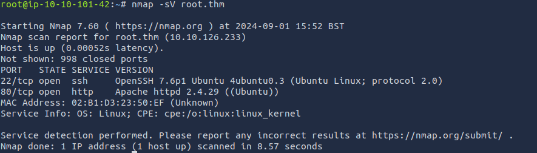
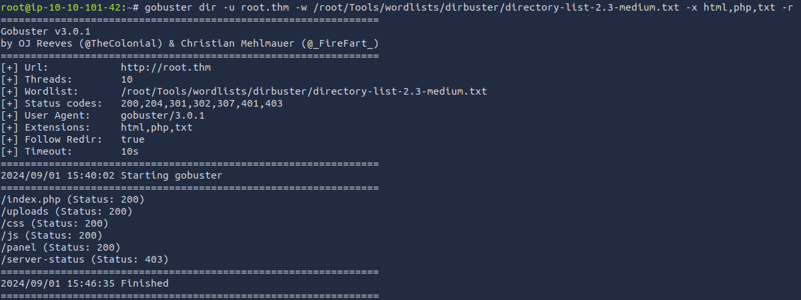
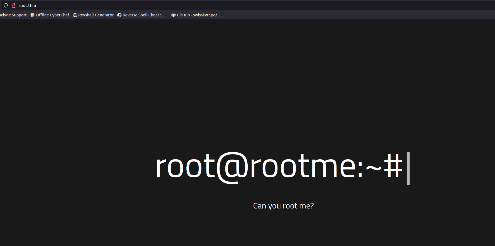
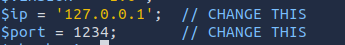
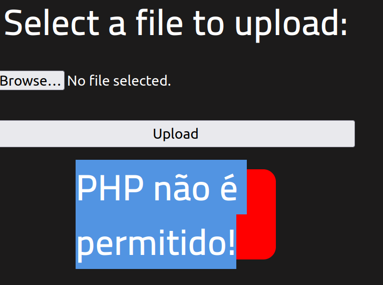
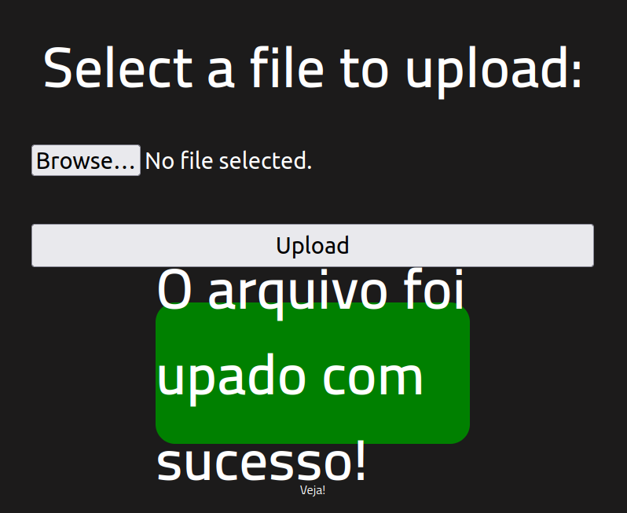
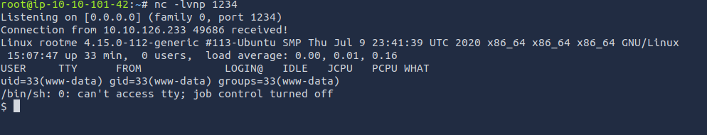
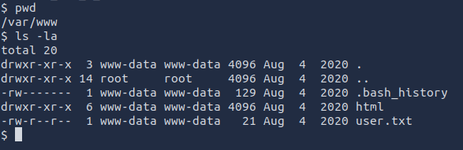
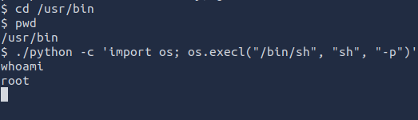

# ROOT_ME WRITEUP
[9/1/24]

## Optional but useful:
When starting the machine, I got the IP and put it in hosts. To make it more efficient at getting to the site. IP: 10.10.126.233; host: root.thm.

## Recon:

Starting this machine, I ran an nmap scan to see the open ports.

With the nmap scan, we can see the http port open, and we can run a directory scan. Using the gobuster tool, this is the result.

## Enumeration

When going to the site, we see this:

However, we see that there is a /panel directory. It looks like we can upload a file to the site. Which means that we might be able to get a reverse shell onto the server. A good reverse shell is created by pentestmonkey.

The reverse shell is created in PHP. Although the most important part of the file is changing the IP and port.

Although there is at least one filter on this site not allowing .php files.

For some reason it is in Portuguese.

However, .php is one of the PHP-type files. Others include: .php5, .php2, .phtml. There are others, but these might work.

Perfect, the .php5 extension works, and now the file is in the system.

Looking back on the Gobuster scan, we see a /uploads/ directory. When going to that directory, we see the .php5 file. Before clicking the file, make sure that your Netcat is listening to the port. Payload: `nc -lvnp [port number]` If the netcat worked and the file is going to the right IP and port, it will give you access.

When running whoami, you will see that you are `www-data`.

When looking around and going to the /var/www/ directory, you will find user.txt with a flag.

For the next challenge, we need to find a weird file with SUID permission. After looking at the man page and different types of payloads, the one found was.

`find / -type f -user root -perm /4000 2>/dev/null`

`-type f`: looking for only files

`-user`: looking for users

`-perm`: with specific permission number

`2>/dev/null`: sends failed outputs to that file extension.

After running that payload, there were a lot fewer results, and we know that we are looking for a /*** / *** / ****** file, and by trying the ones that fit the case, you will find the answer. Now we need to gain root access. However, we don't have access to the sudo command, so we can't look into the root directory.

However, there was a hint on the tryhackme room page saying find gtfobins. After looking around, gtfobins looks like it is a type of privilege escalation due to different execution file types, like Python. When running the command below, you will gain root privileges. Then, if you go to /root and cat the file, you will get the final key.

## Conclusion

After running the Gobuster scan, seeing /uploads and /panel allowed us to reverse shell into the system. When going to /var/www, you will find the first flag. Then, when finding files that are given SUID permissions, like the one needed, it allowed for privilege escalation to root and getting the last flag.

### Reference:
    -gtfobins: 
        https://gtfobins.github.io/ 
        (privilege escalation)

    -lightkunyagami: 
        https://beginninghacking.net/2020/09/09/try-hack-me-rootme/ 
        (using 2>/dev/null at the end of the find command)
